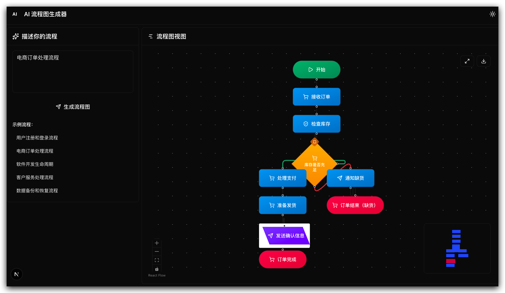

# AI Flowchart Generator

An intelligent flowchart generation tool powered by Next.js and AI. Simply input text descriptions to automatically generate visual flowcharts.



## Features

- 🤖 AI-powered flowchart generation
- 🎨 Interactive visualization with React Flow
- ⚡ Real-time response and fast generation
- 📱 Responsive design with mobile support
- 🛠 Smart error handling

## Tech Stack

Next.js 15 • React 19 • TypeScript • Tailwind CSS • React Flow • OpenAI SDK

## Quick Start

```bash
# Install dependencies
pnpm install

# Configure environment variables (copy .env.example to .env and fill in your API key)
cp .env.example .env

# Start development server
pnpm dev
```

Visit [http://localhost:3000](http://localhost:3000) to get started.

## Usage

1. Describe your process in the input box (e.g., "user registration flow", "order processing flow")
2. Click the generate button
3. AI automatically analyzes and generates a visual flowchart

## Deployment

Recommended to deploy with Vercel one-click deployment, or deploy to any platform that supports Node.js.

## Development

- Flow recognition logic: `src/lib/flowUtils.ts`
- AI prompt optimization: `src/app/api/generate-flow/route.ts`
- Node style customization: `src/app/globals.css`

## License

MIT License
