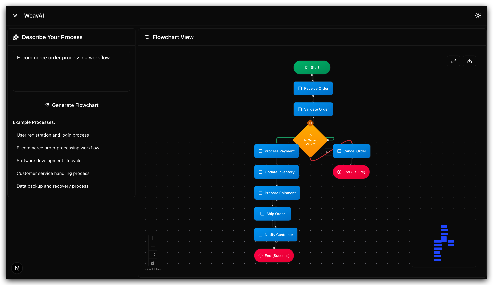

# WeavAI

**One-Click Flowchart Generation** - Simply describe your process in text, and AI automatically generates professional visual flowcharts



## Key Features

✨ **One-Click Generation** - Input description, get complete flowchart instantly  
🎯 **Smart Recognition** - AI automatically analyzes process logic and node relationships  
🎨 **Interactive Editing** - Support drag, zoom, and real-time adjustments  
📱 **Responsive Design** - Perfect for both desktop and mobile

## Quick Start

```bash
pnpm install && cp .env.example .env && pnpm dev
```

Visit [http://localhost:3000](http://localhost:3000) to get started

## How to Use

1. **Input Description** - Describe your process in the text box (e.g., "user registration flow", "order processing flow")
2. **One-Click Generate** - Click the generate button, AI automatically creates the flowchart
3. **Ready to Use** - Get professional visual flowcharts that support export and sharing

## Deployment

Recommended to deploy with Vercel one-click deployment, or deploy to any platform that supports Node.js.

## Development

- Flow recognition logic: `src/lib/flowUtils.ts`
- AI prompt optimization: `src/app/api/generate-flow/route.ts`
- Node style customization: `src/app/globals.css`

## License

MIT License
